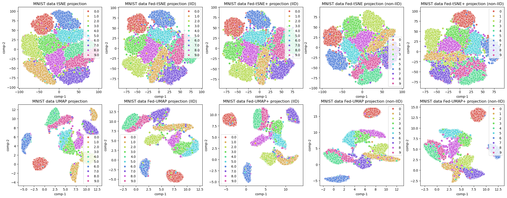

# Federated t-SNE and UMAP for Distributed Data Visualization


[](https://arxiv.org/abs/2412.13495)
[](https://opensource.org/licenses/Apache-2.0)

High-dimensional data visualization is crucial in the big data era and these techniques such as t-SNE and UMAP have been widely used in science and engineering. Big data, however, is often distributed across multiple data centers and subject to security and privacy concerns, which leads to difficulties for the standard algorithms of t-SNE and UMAP. 

To tackle the challenge, this work proposes Fed-tSNE and Fed-UMAP, which provide high-dimensional data visualization under the framework of federated learning, without exchanging data across clients or sending data to the central server. The main idea of Fed-tSNE and Fed-UMAP is implicitly learning the distribution information of data in a manner of federated learning and then estimating the global distance matrix for t-SNE and UMAP. To further enhance the protection of data privacy, we propose Fed-tSNE+ and Fed-UMAP+. We also extend our idea to federated spectral clustering, yielding algorithms of clustering distributed data. 

In addition to these new algorithms, we offer theoretical guarantees of optimization convergence, distance and similarity estimation, and differential privacy. Experiments on multiple datasets demonstrate that, compared to the original algorithms, the accuracy drops of our federated algorithms are tiny.



## Project structure

- `notebooks/`
  - `fed_speclust_mnist/`: core model and experiment notebooks
  - `visualization/`: visualization results and display notebooks
  - `figure_convergence/`: convergence curve notebooks
  - `figure_nmi_beta/`: NMI vs Beta experiment notebooks
  - `figure_nmi_ny/`: NMI vs NY experiment notebooks
  - `table_mnist/`: MNIST table result notebooks
- `figures/`: all figure outputs (png/jpg)
- `README.md`: project description and usage guide

## Quick start

1. Clone the repository

```bash
git clone <your-repo-url>
cd Federated-t-SNE-and-UMAP
```

2. It is recommended to use a virtual environment

```bash
python3 -m venv venv
source venv/bin/activate
pip install --upgrade pip
pip install -r requirements.txt
```

3. Launch Jupyter Lab/Notebook

```bash
jupyter lab
```

4. Open and run notebooks under `notebooks/`

## Dependency note

The project uses PyTorch / torchvision and UMAP. If you need a specific PyTorch build (CUDA or CPU), install with:

```bash
pip install torch torchvision --index-url https://download.pytorch.org/whl/cpu  # CPU-only
# or
pip install torch torchvision --index-url https://download.pytorch.org/whl/cu118  # CUDA 11.8
```

Then install the remaining packages:

```bash
pip install -r requirements.txt
```

## License

Apache 2.0
